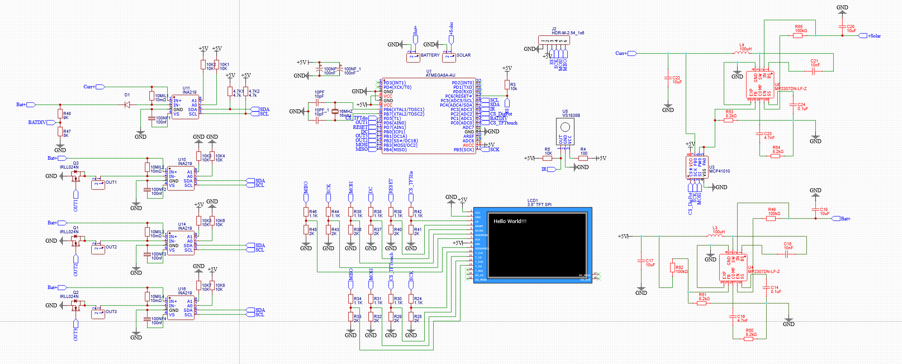

# Maximum power point tracker
This project was my attempt at building an MPPT (Maximum Power Point Tracking) controller for a solar panel system. The device was designed to step down the voltage from a solar panel while continuously tracking the operating point that delivers the maximum power output. The system could then efficiently power connected loads and charge a 12V battery.

# Project Requirements
- Built around the ATmega328P microcontroller as the main control unit
- Integrated TFT color display for user interface and system monitoring
- Included four current and voltage outputs monitors
- Designed for a 12V+ input power system
- Featured PWM-controllable outputs
- Software controlled step-down converter

# Desigining
In the schematic design, I used the INA219 as the current and voltage sensor because it is a widely used IC with an I2C interface, allowing multiple sensors to operate on the same bus by assigning different addresses. This made it possible to implement four independent measurement channels.
For PWM control of the outputs, I selected the IRLL024N MOSFETs due to their ability to handle relatively high currents while maintaining a compact form factor.
To interface the TFT display with the microcontroller, resistor dividers were used as simple 5V-to-3.3V logic level shifters, ensuring compatibility between the ATmega328P and the display module.
The main power supply section was based on the circuitry commonly found in the Mini-360 Buck Converter, configured to provide a regulated 5V output for the control electronics.
For the MPPT functionality, the system required both power measurement and a controllable DC-DC converter. To achieve this, I used the MCP41010 to adjust the feedback network of another Mini-360-based buck converter through software control. (Here lies my mistake)
As an additional feature, I integrated an IR receiver module to enable wireless switching and control of the outputs using a remote controller.
At the end the schematic was converter to a PCB and soldered by hand when it arrived.

# Software
Communication between components and microcontroller programming were implemented using both I2C and SPI protocols. Devices connected through I2C were differentiated by unique addresses, while SPI peripherals were managed through dedicated chip-select lines.
Output selection and control were integrated into the device GUI, allowing the user to manage each output channel individually. Every output supports PWM control for adjustable power delivery and includes overcurrent protection with automatic shutdown functionality to improve system safety and reliability.

# Hardships
One of the main challenges encountered during development was configuring the touch display functionality, which was ultimately unsuccessful. Fortunately, the implemented IR receiver provided an alternative method for user input and system control, allowing the project to remain functional despite the limitation.
Another issue originated from the digital potentiometer implementation. During the design phase, an error was made by connecting the potentiometer terminals to a voltage higher than the IC supply voltage. This hardware design mistake prevented proper operation of dynamic power point tracking, making it impossible to fully implement the intended maximum power optimization functionality.

# Final product
