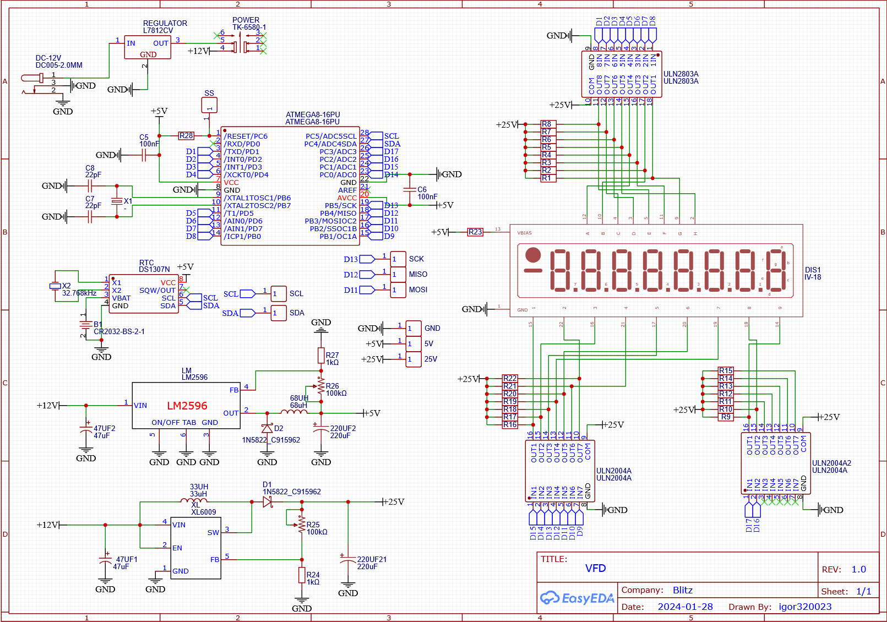
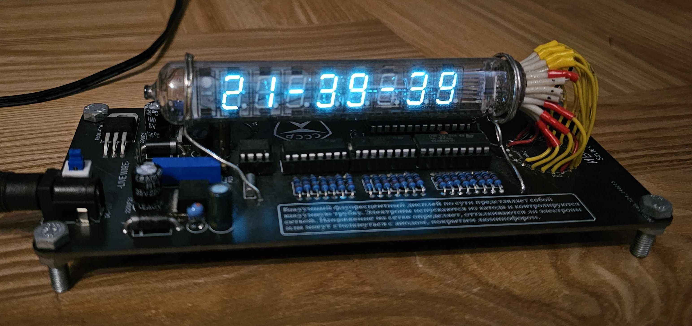

# IV-18 Vacuum Fluorescent Display Clock

This project was an attempt to design and build a multiplexed digital clock using a vintage Russian IV-18 Vacuum Fluorescent Display (VFD) tube. The objective was to create a functional real-time clock while exploring power electronics, embedded programming, display multiplexing, and RTC communication.

## Project Requirements

- Multiplexed VFD display control
- Real-time clock functionality
- Battery-backed time retention
- Adjustable power delivery for multiple voltage domains

 

## Power Section

The system requires three separate voltage rails for proper operation:

### 25V Display Supply
The IV-18 VFD requires approximately 25V for operation. An XL6009 boost converter was used to step up the input voltage to the required display voltage. The output can be dynamically adjusted if needed.

### 5V Logic Supply
The digital control circuitry operates at 5V. An LM2596 buck converter was used to generate this supply voltage efficiently, with adjustable output capability.

### 3V RTC Backup Supply
A dedicated 3V backup battery supply was implemented using a watch battery holder. This allows the RTC module to retain time information when the primary power source is disconnected.

### Input Protection
A 12V linear regulator was added after the main input stage to improve power stability and help protect the circuit from voltage spikes and ripple.

 

## Logic Section

The main controller of the system is an ATmega8 microcontroller. It was selected due to its low cost, sufficient processing capability, and support for I²C communication required for RTC integration. Display multiplexing is handled directly by the microcontroller. Since the VFD requires higher drive capability than the ATmega8 can provide directly, ULN2004 and ULN2803 Darlington transistor arrays were used for segment driving.

One limitation of this implementation is signal inversion. Logic HIGH from the microcontroller disables a segment, while a logic LOW enables it.
Timekeeping functionality is provided by the DS1307 RTC module, which communicates with the microcontroller through the I²C interface.

Firmware programming of the ATmega8 was performed using SPI.

 

 

# Software

Display multiplexing is implemented using internal timer interrupts. Each timer overflow event activates the next display digit in sequence, creating the appearance of a continuously illuminated display.
GPIO to segment mapping is stored in lookup arrays to simplify digit rendering.
One optimization opportunity identified during development would be placing all VFD grid control lines on a single microcontroller port. This would allow direct port manipulation and improve refresh efficiency.

The RTC is continuously polled, ensuring the displayed time remains synchronized and accurate.

 

# Development Challenges

The primary challenge during development involved the DS1307 RTC.

Programming and communication with the RTC proved unreliable. The device would occasionally lose stored time information or stop responding entirely. Even when functioning correctly, noticeable timing drift appeared over extended operation.
Initial debugging suggested the crystal oscillator might be contributing to the issue. Replacing the crystal improved long term accuracy, but communication reliability problems persisted.
While the root cause was never fully isolated, the debugging process provided valuable experience in embedded system troubleshooting and hardware validation.

 

# Final Result

The completed project successfully demonstrated:

- Multiplexed VFD display control
- Multi-voltage power system design
- Embedded firmware development on AVR architecture
- RTC communication using I²C
- Hardware debugging and validation techniques

The project provided practical experience in embedded electronics design while highlighting real-world challenges involved in integrating legacy display technology with modern control systems.

